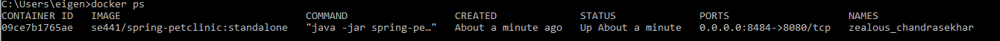
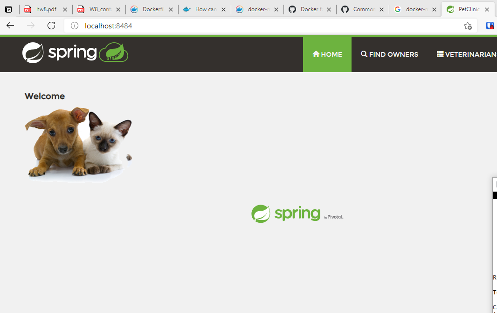
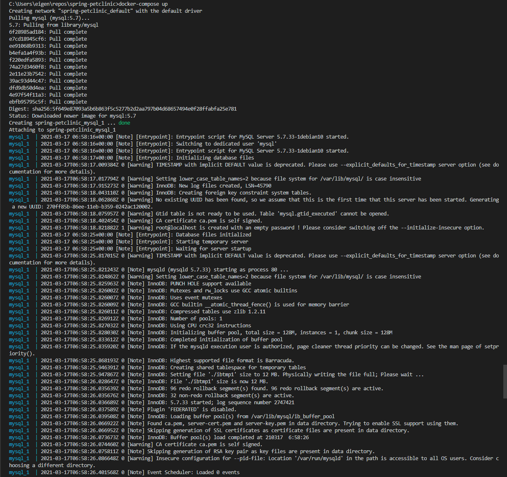
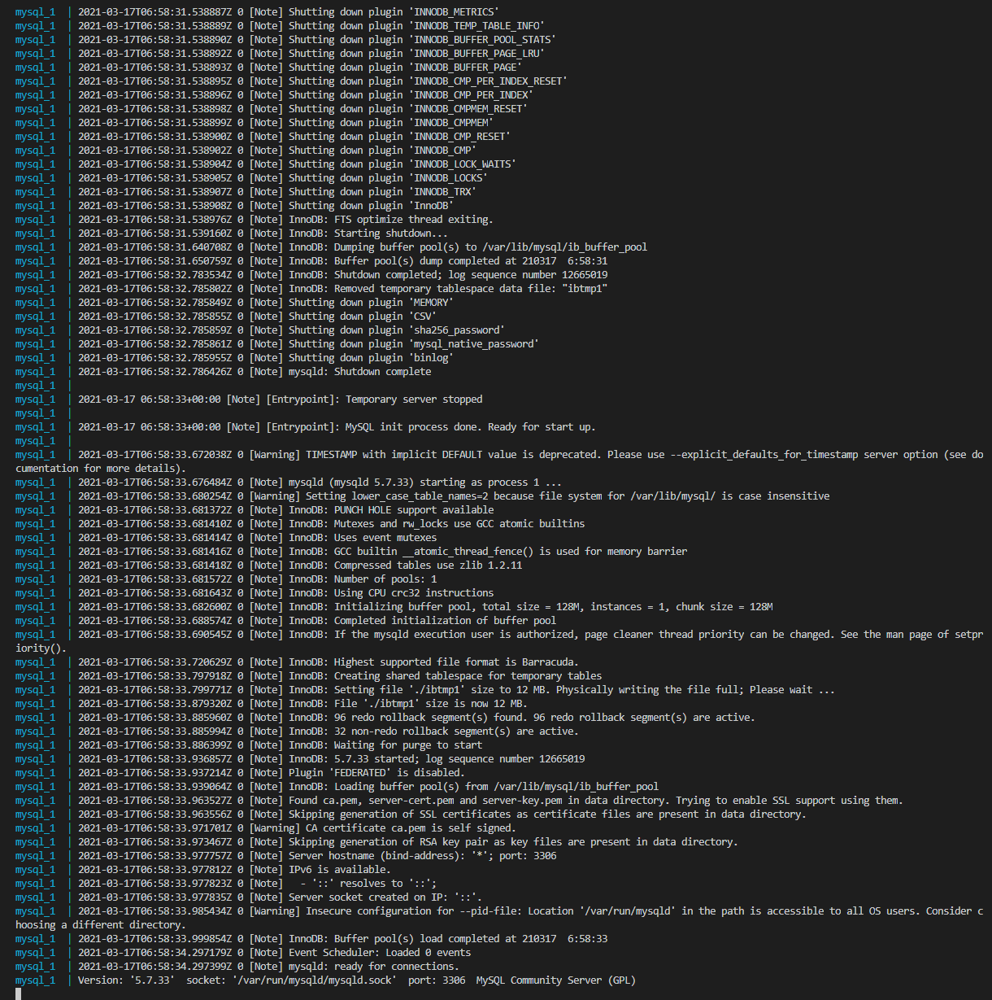
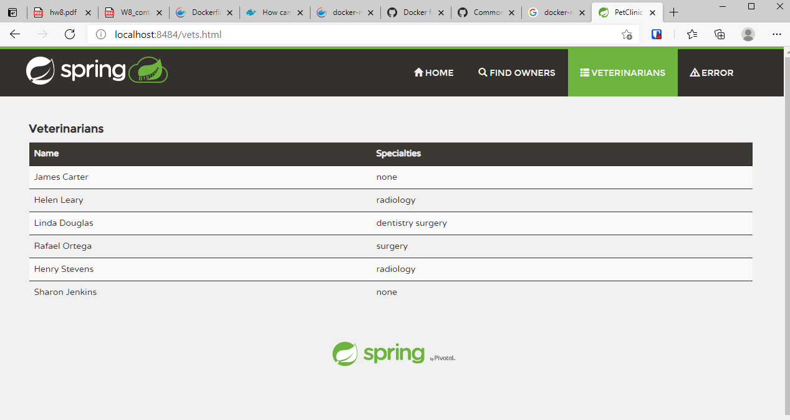
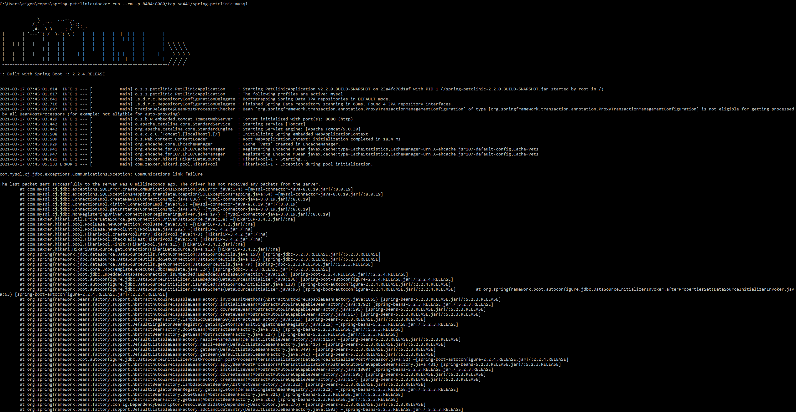
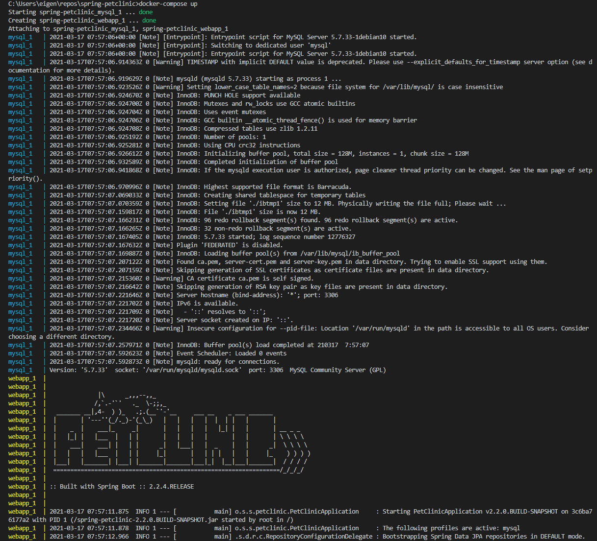
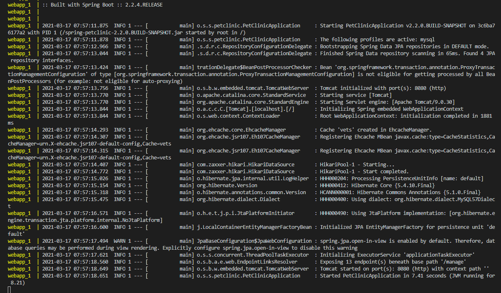
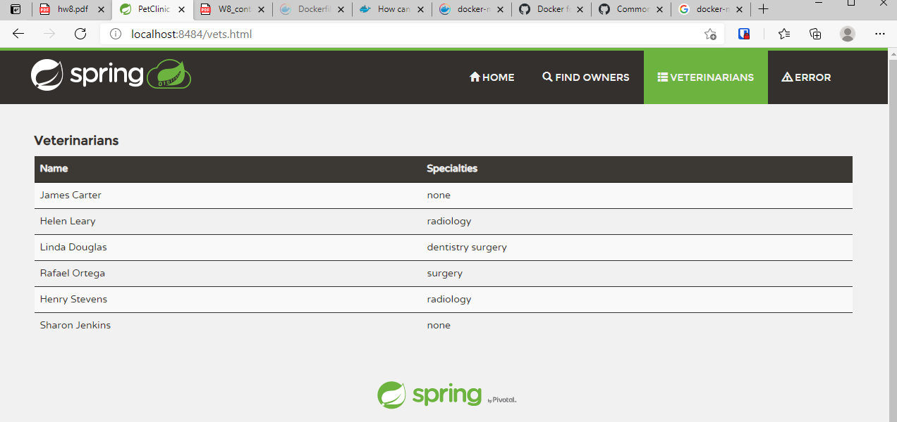

## DOCKER

Link to Dockerfile: [Dockerfile](Dockerfile)  

docker ps  
  

Website from your local container  
  

## DOCKER COMPOSE - MYSQL ONLY  

Output from docker-compose up   
    
  

Browser  
  

Stack trace  
  

## DOCKER COMPOSE - APP SERVER AND MYSQL  

Link to updated docker-compose.yml file: [docker-compose.yml](docker-compose.yml)     

Link to updated application-mysql.properties file: [application-mysql.properties](src/main/resources/application-mysql.properties)  

Output from docker-compose up  

      
    

Browser    
    
